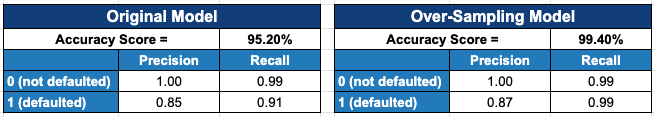

# Credit Risk Resampling Report

## Overview of the Analysis

When working with classifying loan, whether it is a risky loan or a less risky one, it is common to have an imbalanced dataset. This is because the number of healthy loan is significantly greater than the risky one. The purpose of this analysis is to use the machine learning model with the oversampling method to best predict the likelihood that a particular loan will be defaulted.

The dataset used in this model consists of the information on loan size, interest rate, borrower income, debt to income ratio, number of accounts borrowers have, derogatory marks, and total debts. These variables will be used to predicted whether the loan will be defaulted.

By using the `value_counts` function, we have seen that the default loan (denoted by 1) comprises of only 3% of the dataset. The rest of the data are non-defaulted loan (denoted by 0). This shows that there is an imbalanced in the data.

From this dataset, the first step is to divide it into training and testing data. The logistic regression is used to fit the model and predicts the ourcome. Because the dataset is imbalanced, resampling method has been used. Specifically, the `RandomOverSampler` is used to to resample the training data, so that the 0 and 1 becomes more balanced.

## Results

The following bulleted list describes the balanced accuracy scores and the precision and recall scores of all machine learning models used in the analysis.

* Machine Learning Model 1 (original method):
  * Accuracy score = 95%
  
  The accuracy of 95% indicated tested data were accurately identified (as default or non-default) by the model.
  
  * Precision score = 100% for non-defaulted loan and 85% for defaulted loan
 
  This precision score measures how confident we are that the model made the positive prediction. It divides the true positive by the sum of true positive and false positive. For this case, almost all the data (>99.9%) that were predicted as true were actually true. However, only 85% of the loans that were predicted as default are actually defaulted.
 
  * Recall scores = 99% for non-defaulted loan and 91% for defaulted loan
  
  The recall score measures the number of actually defaulted loan that the model correctly classified as default. It is calculated by dividing true positive by the sum of true positive and false negative. With the non-defaulted loan, we can see that the model coorectly predicted 99% of the instances, whereas such figure is only 91% for the defaulted one.
  
  Explanation 1
  
* Machine Learning Model 2 (oversampling method):
  * Accuracy score = 99%
 
  The accuracy of 99% indicated tested data were accurately identified (as default or non-default) by the model.
 
  * Precision score = 100% for non-defaulted loan and 84% for defaulted loan
  
  As explained above, the precision score measures how confident we are that the model made the positive prediction. After the oversampling method has been applied, the result of the precision does not change much, though the precision score for the defaulted loan reduces from 85% to 84%.
  
  * Recall scores = 99% for non-defaulted loan and 99% for defaulted loan
  
  As mentioned, the recall score inducates the number of actually defaulted loan that the model correctly classified as default. The model did a better job after oversampling method has been applied as the recall scores are 99% for both non-defaulted loan and defaulted one.

## Summary

From the summary table above, it can be seen that the over-sampling method does a better job at categorizing the loan than the original model. Even though the precision and recall scores are the same for both method in categorizing non-defaulted loans. the over-sampling method does a better job at categorizing the defaulted loans.

In addition to use this machine learning method, it would also take a look at the percentage of loan payment as an outcome variable and see whether each of the explanation variables are significant in contributing to the percentage of loan payment. For example, if both borrowers borrow $1,000, we want to loan to those who can pay up $1,000 more quickly than those who take longer time to pay. By using this machine learning method alone, it is hard to see other dimension of the problem, e.g. how likely the loan will be defaulted (from 0% to 100%) rather than seeing it as a binary (0 and 1)
